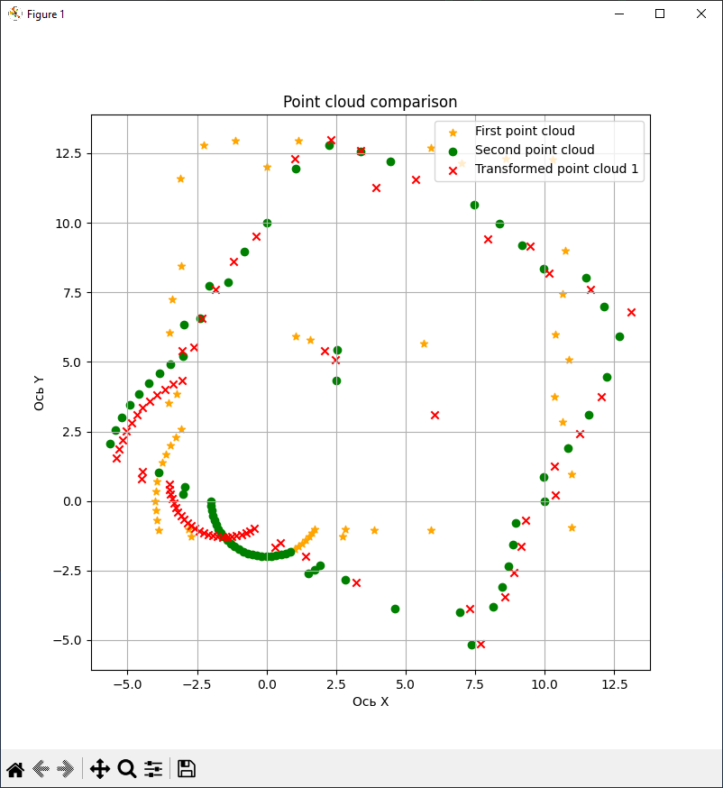
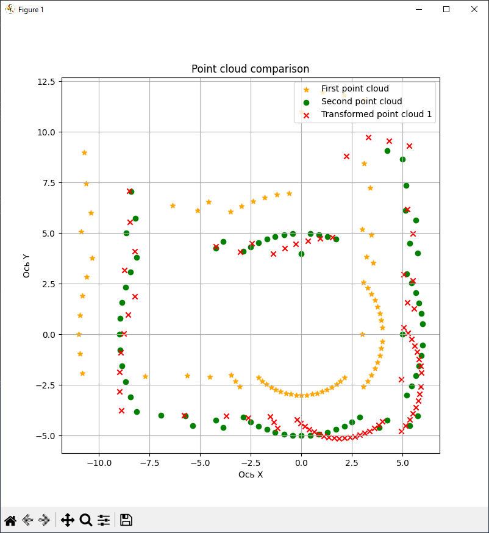

### Lysak Kirill
# Room 1. Iteration 1

MAP_SIZE=15 SCAN_STEP=5 start_state=RobotState(x=4, y=6, theta=0) end_state=RobotState(x=8, y=10, theta=0)
Accuracy of X/Y transformation vector - 0.212%
True Transformation
	X	4
	Y	4
	θ(rad)	0
Calculated Transformation
	X	3.968
	Y	4.032
	θ(rad)	-0.026
Differences in Transformations (% of room size)
	X	0.032 (0.213%)
	Y	0.032 (0.213%)
	θ(rad)	0.026 (0.414%)
# Room 1. Iteration 2

MAP_SIZE=15 SCAN_STEP=5 start_state=RobotState(x=2, y=12, theta=0) end_state=RobotState(x=6, y=8, theta=0)
Accuracy of X/Y transformation vector - 0.764%
True Transformation
	X	4
	Y	-4
	θ(rad)	0
Calculated Transformation
	X	4.159
	Y	-4.03
	θ(rad)	0.008
Differences in Transformations (% of room size)
	X	0.159 (1.06%)
	Y	0.03 (0.2%)
	θ(rad)	0.008 (0.127%)

# Room 1. Iteration 3

MAP_SIZE=15 SCAN_STEP=5 start_state=RobotState(x=7, y=7, theta=0) end_state=RobotState(x=6, y=8, theta=0.5235987755982988)
Accuracy of X/Y transformation vector - 4.049%
True Transformation
	X	-1
	Y	1
	θ(rad)	0.524
Calculated Transformation
	X	-0.211
	Y	1.34
	θ(rad)	0.534
Differences in Transformations (% of room size)
	X	0.789 (5.26%)
	Y	0.34 (2.267%)
	θ(rad)	0.011 (0.175%)
# Room 1. Iteration 4

MAP_SIZE=15 SCAN_STEP=5 start_state=RobotState(x=7, y=7, theta=0) end_state=RobotState(x=8, y=8, theta=0.5235987755982988)
Accuracy of X/Y transformation vector - 3.658%
True Transformation
	X	1
	Y	1
	θ(rad)	0.524
Calculated Transformation
	X	1.505
	Y	0.411
	θ(rad)	0.507
Differences in Transformations (% of room size)
	X	0.505 (3.367%)
	Y	0.589 (3.927%)
	θ(rad)	0.016 (0.255%)
# Room 1. Iteration 5

MAP_SIZE=15 SCAN_STEP=5 start_state=RobotState(x=7, y=7, theta=0) end_state=RobotState(x=7, y=7, theta=3.141592653589793)
Accuracy of X/Y transformation vector - 7.839%
True Transformation
	X	0
	Y	0
	θ(rad)	3.142
Calculated Transformation
	X	0.358
	Y	1.624
	θ(rad)	0.015
Differences in Transformations (% of room size)
	X	0.358 (2.387%)
	Y	1.624 (10.827%)
	θ(rad)	3.126 (49.752%)
# Room 2. Iteration 1

MAP_SIZE=15 SCAN_STEP=5 start_state=RobotState(x=7, y=3, theta=0) end_state=RobotState(x=7, y=1, theta=0)
Accuracy of X/Y transformation vector - 0.933%
True Transformation
	X	0
	Y	-2
	θ(rad)	0
Calculated Transformation
	X	-0.035
	Y	-2.195
	θ(rad)	-0.008
Differences in Transformations (% of room size)
	X	0.035 (0.233%)
	Y	0.195 (1.3%)
	θ(rad)	0.008 (0.127%)

# Room 2. Iteration 2

MAP_SIZE=15 SCAN_STEP=5 start_state=RobotState(x=2, y=2, theta=0) end_state=RobotState(x=12, y=2, theta=0)
Accuracy of X/Y transformation vector - 50.186%
True Transformation
	X	10
	Y	0
	θ(rad)	0
Calculated Transformation
	X	-0.646
	Y	-0.09
	θ(rad)	-1.489
Differences in Transformations (% of room size)
	X	10.646 (70.973%)
	Y	0.09 (0.6%)
	θ(rad)	1.489 (23.698%)
# Room 2. Iteration 3

MAP_SIZE=15 SCAN_STEP=5 start_state=RobotState(x=7, y=3, theta=0.7853981633974483) end_state=RobotState(x=7, y=3, theta=2.356194490192345)
Accuracy of X/Y transformation vector - 0.311%
True Transformation
	X	0
	Y	0
	θ(rad)	1.571
Calculated Transformation
	X	0.052
	Y	0.041
	θ(rad)	1.559
Differences in Transformations (% of room size)
	X	0.052 (0.347%)
	Y	0.041 (0.273%)
	θ(rad)	0.012 (0.191%)
# Room 2. Iteration 4

MAP_SIZE=15 SCAN_STEP=5 start_state=RobotState(x=4, y=2, theta=0) end_state=RobotState(x=6, y=2, theta=0.5235987755982988)
Accuracy of X/Y transformation vector - 3.96%
True Transformation
	X	2
	Y	0
	θ(rad)	0.524
Calculated Transformation
	X	1.514
	Y	-0.685
	θ(rad)	0.477
Differences in Transformations (% of room size)
	X	0.486 (3.24%)
	Y	0.685 (4.567%)
	θ(rad)	0.047 (0.748%)
# Room 2. Iteration 5

MAP_SIZE=15 SCAN_STEP=5 start_state=RobotState(x=10, y=12, theta=0) end_state=RobotState(x=6, y=12, theta=0)
Accuracy of X/Y transformation vector - 0.471%
True Transformation
	X	-4
	Y	0
	θ(rad)	0
Calculated Transformation
	X	-3.962
	Y	-0.092
	θ(rad)	0.008
Differences in Transformations (% of room size)
	X	0.038 (0.253%)
	Y	0.092 (0.613%)
	θ(rad)	0.008 (0.127%)

# Room 3. Iteration 1

MAP_SIZE=15 SCAN_STEP=5 start_state=RobotState(x=3, y=7, theta=0) end_state=RobotState(x=11, y=7, theta=0)
Accuracy of X/Y transformation vector - 31.853%
True Transformation
	X	8
	Y	0
	θ(rad)	0
Calculated Transformation
	X	1.281
	Y	-0.719
	θ(rad)	0.311
Differences in Transformations (% of room size)
	X	6.719 (44.793%)
	Y	0.719 (4.793%)
	θ(rad)	0.311 (4.95%)
# Room 3. Iteration 2

MAP_SIZE=15 SCAN_STEP=5 start_state=RobotState(x=5, y=7, theta=0) end_state=RobotState(x=7, y=7, theta=0)
Accuracy of X/Y transformation vector - 0.481%
True Transformation
	X	2
	Y	0
	θ(rad)	0
Calculated Transformation
	X	2.101
	Y	-0.012
	θ(rad)	0.046
Differences in Transformations (% of room size)
	X	0.101 (0.673%)
	Y	0.012 (0.08%)
	θ(rad)	0.046 (0.732%)
# Room 3. Iteration 3

MAP_SIZE=15 SCAN_STEP=5 start_state=RobotState(x=7, y=7, theta=0.0) end_state=RobotState(x=7, y=7, theta=1.0471975511965976)
Accuracy of X/Y transformation vector - 7.019%
True Transformation
	X	0
	Y	0
	θ(rad)	1.047
Calculated Transformation
	X	-1.146
	Y	0.951
	θ(rad)	-0.522
Differences in Transformations (% of room size)
	X	1.146 (7.64%)
	Y	0.951 (6.34%)
	θ(rad)	1.569 (24.971%)
# Room 3. Iteration 4

MAP_SIZE=15 SCAN_STEP=5 start_state=RobotState(x=7, y=7, theta=0.0) end_state=RobotState(x=7, y=9, theta=1.0471975511965976)
Accuracy of X/Y transformation vector - 4.332%
True Transformation
	X	0
	Y	2
	θ(rad)	1.047
Calculated Transformation
	X	0.917
	Y	2.054
	θ(rad)	-0.497
Differences in Transformations (% of room size)
	X	0.917 (6.113%)
	Y	0.054 (0.36%)
	θ(rad)	1.544 (24.574%)
# Room 4. Iteration 1

MAP_SIZE=15 SCAN_STEP=5 start_state=RobotState(x=11, y=3, theta=0) end_state=RobotState(x=9, y=5, theta=0)
Accuracy of X/Y transformation vector - 0.721%
True Transformation
	X	-2
	Y	2
	θ(rad)	0
Calculated Transformation
	X	-1.943
	Y	2.142
	θ(rad)	0.026
Differences in Transformations (% of room size)
	X	0.057 (0.38%)
	Y	0.142 (0.947%)
	θ(rad)	0.026 (0.414%)
# Room 4. Iteration 2

MAP_SIZE=15 SCAN_STEP=5 start_state=RobotState(x=3, y=2, theta=0) end_state=RobotState(x=11, y=2, theta=0)
Accuracy of X/Y transformation vector - 42.86%
True Transformation
	X	8
	Y	0
	θ(rad)	0
Calculated Transformation
	X	-1.078
	Y	-0.496
	θ(rad)	-1.21
Differences in Transformations (% of room size)
	X	9.078 (60.52%)
	Y	0.496 (3.307%)
	θ(rad)	1.21 (19.258%)
# Room 4. Iteration 3

MAP_SIZE=15 SCAN_STEP=5 start_state=RobotState(x=5, y=5, theta=0.5235987755982988) end_state=RobotState(x=5, y=5, theta=1.0471975511965976)
Accuracy of X/Y transformation vector - 0.0%
True Transformation
	X	0
	Y	0
	θ(rad)	0.524
Calculated Transformation
	X	-0.0
	Y	0.0
	θ(rad)	0.524
Differences in Transformations (% of room size)
	X	0.0 (0.0%)
	Y	0.0 (0.0%)
	θ(rad)	0.0 (0.0%)
# Room 4. Iteration 4

MAP_SIZE=15 SCAN_STEP=5 start_state=RobotState(x=5, y=5, theta=1.0471975511965976) end_state=RobotState(x=5, y=5, theta=0.5235987755982988)
Accuracy of X/Y transformation vector - 0.0%
True Transformation
	X	0
	Y	0
	θ(rad)	-0.524
Calculated Transformation
	X	-0.0
	Y	-0.0
	θ(rad)	-0.524
Differences in Transformations (% of room size)
	X	0.0 (0.0%)
	Y	0.0 (0.0%)
	θ(rad)	0.0 (0.0%)

На графике представлены результаты точности трансформации вектора X/Y для различных комнат и итераций. Каждая точка на графике отображает точность для определенной итерации в конкретной комнате. Цвет точек соответствует номеру комнаты, как указано на цветовой шкале справа от графика.

Можно увидеть, как точность варьируется от одной итерации к другой и между разными комнатами. Некоторые итерации показывают очень высокую точность (близкую к 0%), в то время как другие имеют значительные отклонения.